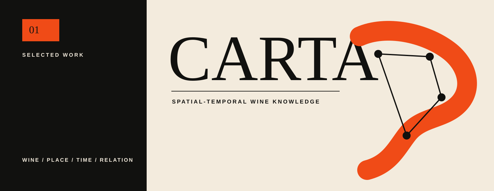
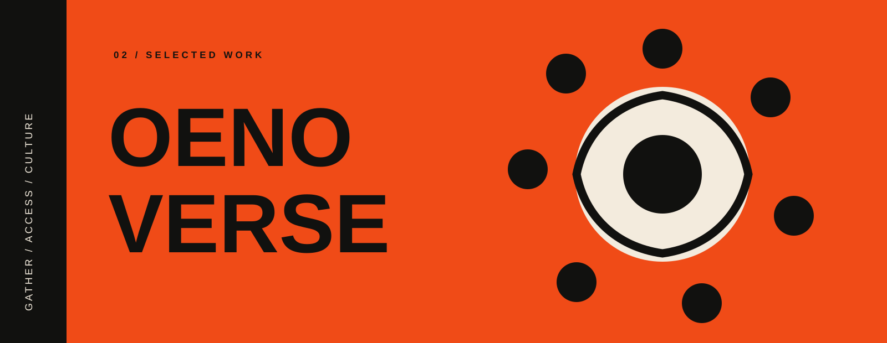
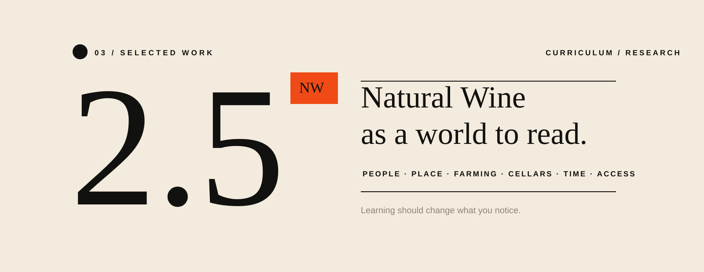
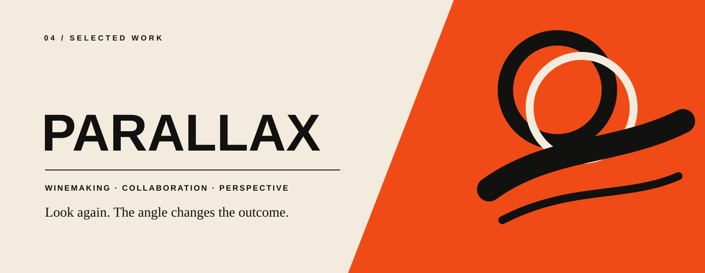

  

## I build systems for learning, work, culture, and place.

My work sits somewhere between career development, community building, cultural infrastructure, and creative practice. I'm learning from systems design, research, and design methods while using whatever tools fit the problem to structure knowledge, investigate messy questions, and turn ideas into things people can explore, use, gather around, and build on.

I'm interested in the space between an idea and the conditions that let it become real: the research, relationships, structure, taste, experimentation, and repeated making that turn a loose possibility into something other people can enter.

---

## Selected Work

  

### CARTA

**A spatial-temporal wine knowledge and field-intelligence system.**

Wine is often documented as a collection of isolated facts. CARTA treats it as a connected world of places, grapes, people, producers, vineyards, law, practices, wines, relationships, and time. The project combines structured research, governed knowledge, editorial reference, and an interactive geographic Atlas.

[Explore CARTA →](https://github.com/thatssoreg/carta)

 

  

### Oenoverse

**An access and opportunity initiative built in and through Virginia wine.**

Oenoverse uses gatherings, education, relationships, and shared experience to make wine culture more open, participatory, and connected. Oeno Camp and Two Up Wine Down are two public expressions of that work, built around the idea that access is not only about getting someone through the door. It is also about creating the conditions for people to belong, learn, contribute, and return.

[Two Up Wine Down →](https://www.twoupwinedown.com/) &nbsp;&nbsp; [Oeno Camp →](https://www.twoupwinedown.com/oeno-camp)

 

  

### Natural Wine 2.5

**An attempt to build the natural-wine education I wanted to exist.**

Natural Wine 2.5 is a research-driven curriculum that moves beyond introductory categories into people, place, farming, cellars, time, access, and the relationships between them. The project treats curriculum as something that has to be researched, structured, tested, maintained, and eventually translated into experiences that change what a learner can notice.

[Explore Natural Wine 2.5 →](https://github.com/thatssoreg/natural-wine-2-5-curriculum)

 

  

### The Parallax Project

**A collaborative Virginia wine project built around the idea that a change in perspective can reveal a different truth.**

The Parallax Project is a place to make wine, ask questions through the material itself, and explore what becomes visible when grapes, regions, styles, timing, and collaborators are viewed from more than one angle.

[Explore The Parallax Project →](https://www.parallaxprojectva.com/)

---

## How I'm Working

I've always been a builder. The form tends to change: a community discovery layer for a city, a career program, a gathering, a curriculum, a wine, a map, a digital tool. I tend to enter early, look across the field I'm in, then outside of it, and build across disciplines with people and in community.

The line between technical and non-technical feels less useful to me than it once did. Technology has increasingly expanded the materials available to me, but the underlying practice is familiar: notice what is missing, learn what the work requires, find collaborators, make a first version, and keep shaping it until other people can use it, gather around it, or build from it.

That pattern predates the current tools. One early version was **LynchVegas**, a community discovery and lifestyle project built from editorial, photography, local relationships, participatory digital experiments, and the belief that places often contain more possibility than people know how to find.

---

## What I'm Exploring

**New materials for builders.**  
What becomes possible when domain knowledge, curiosity, taste, relationships, and increasingly capable tools can be combined by people who do not fit neatly inside one professional discipline?

**Knowledge with shape.**  
How can relationships, geography, time, provenance, uncertainty, and context become part of the structure of information rather than footnotes around it?

**Gatherings as cultural infrastructure.**  
What makes a room, a festival, a camp, a dinner, or a recurring ritual feel like more than an event? How do spaces create connection, participation, memory, and culture?

**Career development after AI.**  
As execution gets cheaper, what happens to professional agency, imagination, judgment, and the ability to decide what work should exist?

**Discovery and place.**  
How do we help people notice what is already around them, understand where they are, and participate more deeply in the places and communities they inhabit?

---

## Some Principles I'm Exploring Right Now

**Discovery is infrastructure.**  
Sometimes the possibility is already there. What is missing is a way to see it.

**Build with people, not only for them.**  
The strongest things become more useful, resilient, and alive when other people can shape them.

**The interface is part of the thinking.**  
How something is encountered changes what can be understood about it.

**You cannot manufacture culture, but you can design conditions for it.**  
Space, invitation, rhythm, access, participation, and care all matter.

**Learning should change what you notice.**  
The best education does more than transfer information. It changes the resolution at which someone experiences the world.

**Look outside the field.**  
A useful idea often arrives from somewhere that was never trying to solve your problem.

---

## Elsewhere

[**reggieleonard.com**](https://www.reggieleonard.com/) · personal site  
[**UVA School of Data Science**](https://datascience.virginia.edu/people/reggie-leonard/profile) · career development + community engagement  
[**Two Up Wine Down**](https://www.twoupwinedown.com/) · gathering + Virginia wine  
[**The Parallax Project**](https://www.parallaxprojectva.com/) · winemaking  
[**LinkedIn**](https://www.linkedin.com/in/reggiel/) · professional
