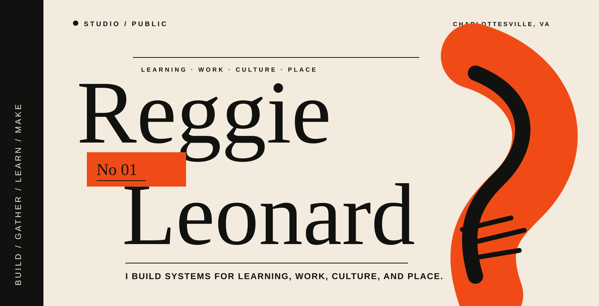
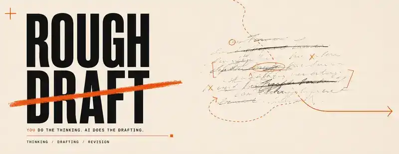
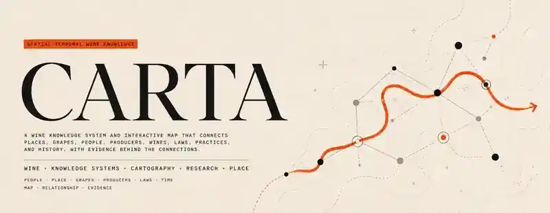
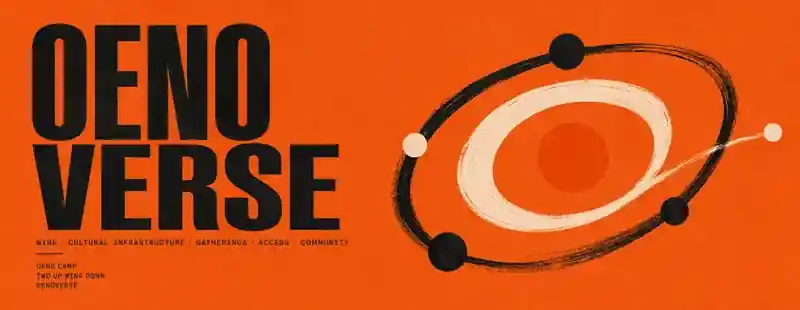
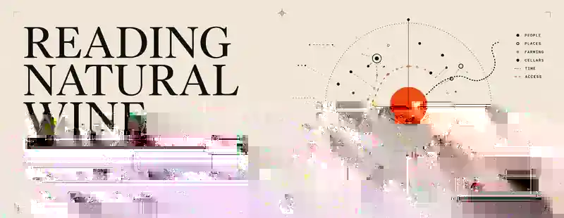
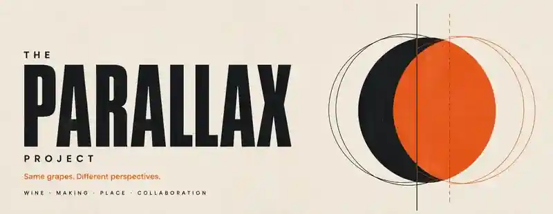

  

## I build systems for learning, work, culture, and place.

My work sits somewhere between career development, community building, cultural infrastructure, and creative practice. I'm learning from systems thinking, research, and design methods while using whatever tools fit the problem to structure knowledge, investigate messy questions, and turn ideas into things people can explore, use, gather around, and build on.

I'm interested in the space between an idea and the conditions that let it become real: the research, relationships, structure, taste, experimentation, and repeated making that turn a loose possibility into something other people can enter.

Ultimately, I'm in the business of increasing capacity. I've found that the best way to do that, even while operating as an individual contributor, is to do things with people.

---

## Selected Work

A few projects that show how the same practice travels across career development, wine, software, research, curriculum, gatherings, and knowledge systems.

  

### Rough Draft

**An interactive AI career guide that helps students build the context and prompts to think through a job search, then use AI to draft from their own evidence.**

*Think of it like a career workbook that can hand your own notes to an AI writing partner.*

Rough Draft is built around one rule: you do the thinking; AI does the drafting. Students build reusable context files such as a career profile, master resume, story bank, job target, and interview prep, then use prompts against that evidence throughout the job search. The optional AI layer can help draft, but the student's judgment, experiences, and context stay upstream of generation.

CAREER DEVELOPMENT · AI · JOB SEARCH · LEARNING DESIGN · WRITING TOOLS  
REACT 19 · VITE 6 · TYPESCRIPT / JSX · TAILWIND CSS 4 · MOTION · GOOGLE GENAI · SERVER API PROXY

**Proof / scale:** Reusable context-file system · optional server-side AI drafting · career guidance sourced from Groundwork instead of duplicated in-app

[Explore Rough Draft →](https://github.com/thatssoreg/rough-draft)

 

  

### Stay Ready

**A career-resilience system for keeping your work legible, your evidence current, your relationships warm, and your options visible before a crisis.**

*Think of it like a maintenance manual for your working life, where the book is only one output.*

Stay Ready treats career preparedness as maintenance rather than emergency response. Its current model organizes four overlapping conditions, Good, Understood, Trusted, and Ready, and five practices for naming work, calibrating against the field, capturing evidence, building rooms and witnesses, and reviewing options. The same governed source can support a book, exercises, assessments, workshops, journeys, and future reader experiences.

CAREER DEVELOPMENT · WRITING · CURRICULUM · PROFESSIONAL AGENCY · GOVERNED KNOWLEDGE  
JSON / MARKDOWN CANON · PYTHON VALIDATION · EXERCISES · JOURNEYS · ASSESSMENTS · RELEASE CHECKSUMS

**Proof / scale:** 36 canon objects · 12 source exercises · machine-readable relationships · preserved validated releases

[Explore Stay Ready →](https://github.com/thatssoreg/stayready)

 

  

### CARTA

**A wine knowledge system and interactive map that connects places, grapes, people, producers, wines, laws, practices, and history, with evidence behind the connections.**

*Think of it like Wikipedia + Google Maps + a family tree for wine, with receipts.*

Most wine references explain individual things well. CARTA is built for the questions between them: how a grape connects to a place, how a producer connects to a vineyard or collaborator, how geography and wine law overlap, and how those relationships change through time. The same researched authority can be explored as structured data, readable reference, relationships, and an interactive map.

WINE · KNOWLEDGE SYSTEMS · CARTOGRAPHY · RESEARCH · PLACE  
PYTHON · MAPLIBRE GL JS · VITE · JSON / MARKDOWN · SCHEMAS · VALIDATORS · OPEN GEOSPATIAL DATA

**Proof / scale:** Governed knowledge system · Human Reference · interactive Atlas · evidence + validation architecture

[Explore CARTA →](https://github.com/thatssoreg/carta)

 

  

### Oenoverse

**An access and opportunity initiative that uses wine education, immersive programs, relationships, and large-scale gatherings to create more ways into and through wine.**

*Think of it like part field school, part cultural festival, part relationship network, built through Virginia wine.*

Oenoverse works in and through Virginia wine, using the local industry as both a place to build opportunity and a way into wine culture more broadly. The point is not simply getting people through the door, but creating the knowledge, relationships, confidence, and pathways that make participation durable.

WINE · CULTURAL INFRASTRUCTURE · GATHERINGS · ACCESS · COMMUNITY  
PROGRAM DESIGN · EVENT PRODUCTION · HOSPITALITY · PARTNERSHIPS · GRANTS · WINE EDUCATION · COMMUNITY NETWORKS

**Proof / scale:** Oeno Camp · Two Up Wine Down · 450+ person annual gathering

[Two Up Wine Down →](https://www.twoupwinedown.com/) &nbsp;&nbsp; [Oeno Camp →](https://www.twoupwinedown.com/oeno-camp)

 

  

### Reading Natural Wine

**A research-heavy course for people who know the basics of natural wine and want to understand the people, places, farming, cellar choices, history, and culture underneath the bottle.**

*Think of it like the class after Natural Wine 101, built like a field guide, research library, and teaching system at once.*

Reading Natural Wine is the public face of a governed research and production system for a deeper natural-wine curriculum. It turns producer research, grape and place dossiers, farming and cellar questions, cultural context, and teaching modules into learner and instructor materials without pretending the category is simpler than it is.

WINE · CURRICULUM · RESEARCH · LEARNING DESIGN · KNOWLEDGE GOVERNANCE  
MARKDOWN · PYTHON · CANONS · SOURCE LEDGERS · ASSEMBLERS · VALIDATORS · DETERMINISTIC PACKAGE GENERATION

**Proof / scale:** 16 teaching modules · governed research layers · learner and instructor package generation

[Explore Reading Natural Wine →](https://github.com/thatssoreg/natural-wine-2-5-curriculum)

 

  

### The Parallax Project

**A commercial Virginia wine label where Lance Lemon and I buy fruit, make small-lot wines at a custom-crush facility, and release them into restaurants, retail, and distribution.**

*Think of it like a test kitchen for Virginia wine, except the experiments are commercially released bottles.*

The project began by asking how the same set of grapes could become very different wines depending on perspective, timing, and process. We produce at Common Wealth Crush and use each vintage to keep testing that idea through fruit, style, and place.

WINE · MAKING · PLACE · COLLABORATION · ENTREPRENEURSHIP  
VIRGINIA FRUIT · CUSTOM CRUSH · COMMERCIAL PRODUCTION · PACKAGING · DISTRIBUTION · RESTAURANT / RETAIL

**Proof / scale:** Commercial releases · first Common Wealth Crush incubator project · restaurant, retail, and distribution placements

[Explore The Parallax Project →](https://www.parallaxprojectva.com/)

---

## How I'm Working

I've always been a builder. The form tends to change: a community discovery layer for a city, a career program, a gathering, a curriculum, a wine, a map, a digital tool. I tend to enter early, look across the field I'm in, and build across disciplines with people.

The line between technical and non-technical feels less useful to me than it once did. Technology has increasingly expanded the materials available to me, but the underlying practice is familiar: notice what is missing, learn what the work requires, find collaborators, make a first version, and keep shaping it until other people can use it, gather around it, or build from it.

That pattern predates the current tools. One early version was **LynchVegas**, a community discovery and lifestyle project built from editorial, photography, local relationships, participatory digital experiments, and the belief that places often contain more possibility than people know how to find. A more recent version is **Oenoverse**, where education, gatherings, relationships, and access become the materials. The forms are different, but the underlying move is similar: notice possibility, make it more visible, and build the conditions for people to participate in it together.

---

## What I'm Exploring

**New materials for builders.**  
What becomes possible when domain knowledge, curiosity, taste, relationships, and increasingly capable tools can be combined by people who do not fit neatly inside one professional discipline?

**Adding shape to knowledge.**  
How can relationships, geography, time, provenance, uncertainty, and context become part of the structure of information rather than footnotes around it?

**Gatherings as cultural infrastructure.**  
What makes a room, a festival, a camp, a dinner, or a recurring ritual feel like more than an event? How do spaces create connection, participation, memory, and culture?

**Career development after AI.**  
As execution gets cheaper, what happens to professional agency, imagination, judgment, and the ability to decide what work should exist?

**Discovery and place.**  
How do we help people notice what is already around them, understand where they are, and participate more deeply in the places and communities they inhabit?

---

## Some Principles I'm Exploring Right Now

**We haven't lived in the best version of the world yet.**  
The fact that something exists does not mean we've found its best form. That leaves enormous room to discover, revisit, recombine, and build what isn't here yet.

**Never arrive.**  
Wander, explore, revisit, revise. I don't want curiosity to be something I use only until I reach an answer.

**The medium is the message.**  
How something is encountered changes what can be understood about it. The form is never neutral.

**Attention is a superpower.**  
Palate is one way I learned this. “Peach” is only the beginning: underripe, perfectly ripe, overripe, stewed? Yellow can become gold, marigold, or bright orange. The more precisely you pay attention, the more experience becomes available to you. Attention plus experience becomes raw material for creativity.

**You cannot manufacture culture, but you can design conditions for it.**  
Space, invitation, rhythm, access, participation, and care all matter.

**Look outside the field.**  
A useful idea often arrives from somewhere that was never trying to solve your problem.

---

## Where to Find Me

[**reggieleonard.com**](https://www.reggieleonard.com/) · personal site  
[**UVA School of Data Science**](https://datascience.virginia.edu/people/reggie-leonard/profile) · career development + community engagement  
[**Two Up Wine Down**](https://www.twoupwinedown.com/) · gathering + Virginia wine  
[**The Parallax Project**](https://www.parallaxprojectva.com/) · winemaking  
[**LinkedIn**](https://www.linkedin.com/in/reggiel/) · professional
